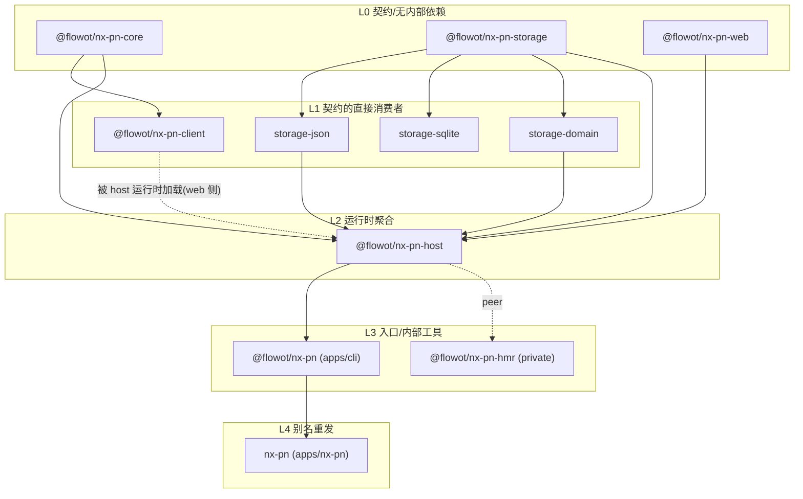
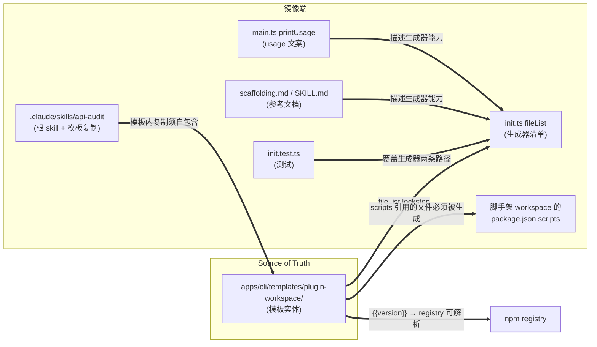

# Project Graph — 依赖层级与一致性冲突定位(2026-09-10)

> **Topic:** cli-consistency
> **类型:** project analysis doc(依赖图 + 冲突归位 + 修复优先级)
> **版本:** v1
> **数据来源:** 全部 11 个 `package.json` 实读(2026-09-10,0.4.4),非旧状态文档转抄
> **前置:** 见 `../multi-package-release/project/2026-09-08-v1-status.md`(发布流程侧的现状)

## 1. 目的

把 2026-09-10 一致性检查发现的 9 个冲突(F1–F9)按**依赖层级**归位,推导修复顺序:
**上游(source of truth)先修,镜像端后修**——避免下游修复被上游变更推翻返工。

## 2. 包依赖层级(npm family 内部边)

### 2.1 依赖边实读

| 包 | 内部依赖 | 外部依赖(参考) |
|---|---|---|
| `@flowot/nx-pn-core` | — | ajv |
| `@flowot/nx-pn-storage` | — | — |
| `@flowot/nx-pn-web` | — | (devDeps: vite/react 等) |
| `@flowot/nx-pn-storage-json` | storage | — |
| `@flowot/nx-pn-storage-sqlite` | storage | — |
| `@flowot/nx-pn-storage-domain` | storage | zod |
| `@flowot/nx-pn-client` | core | cordis;peer: react |
| `@flowot/nx-pn-host` | core, web, storage, storage-json, storage-domain | cordis, esbuild, undici, ws, js-yaml, zod |
| `@flowot/nx-pn-hmr` **(private)** | — | peer: host |
| `@flowot/nx-pn`(apps/cli) | host | — |
| `nx-pn`(apps/nx-pn) | @flowot/nx-pn | — |

与 2026-09-08 状态文档的差异(文档滞后项):
- host **新增** `@flowot/nx-pn-web` 硬依赖(旧文档闭包里没有)
- `storage-sqlite` **已不在** host 硬依赖中(旧文档标注"可选 backend",现在是彻底可选)

### 2.2 层级图(最长路径分层)



| 层 | 包 | 角色 |
|---|---|---|
| **L0** | core / storage / web | 纯契约与地基。core 零 cordis 不变量在此层 |
| **L1** | storage-json / storage-sqlite / storage-domain / client | 契约直连,仍不聚合 |
| **L2** | host | 唯一运行时聚合点(loader/installer/REST/WS) |
| **L3** | @flowot/nx-pn (apps/cli) / hmr (private) | 用户入口 + monorepo 内部工具 |
| **L4** | nx-pn (apps/nx-pn) | unscoped 别名重发 |

## 3. 镜像/分发层(非 npm 依赖边)——冲突集中区

npm 图之外存在一组**必须 lockstep 的镜像边**,它们不在任何 `package.json` 里,CI 无法校验,是本次冲突的全部来源:



| 镜像边 | 校验机制 | 现状 |
|---|---|---|
| 模板实体 ↔ init.ts fileList | 无(仅人工) | **断**(F1) |
| 模板 scripts ↔ 模板文件集 | 无 | **断**(F2) |
| 模板 devDeps ↔ registry 可解析 | 无(preflight 只查 family 闭包,不查模板) | **断**(F4) |
| 根 skill ↔ 模板内 skill 复制 | 无(靠人工 diff) | 残缺(F5) |
| usage/文档 ↔ 生成器实际能力 | 无 | 过时(F7/F8) |
| 测试 ↔ 生成器路径覆盖 | vitest | **半盲**(F3:只盖 init,不盖 init-plugin) |

## 4. 冲突登记(F1–F9 按层级归位)

| ID | 冲突 | 所处层级 | 断裂的边 | 严重度 |
|---|---|---|---|---|
| F1 | `scaffoldPluginInWorkspace` 引用已删除的 `browser.tsx`(`init.ts:294`) | L3 生成器 ↔ 模板实体 | fileList lockstep | 🔴 P0 |
| F2 | 模板 test 脚本指向不存在的 `host.test.ts` | 模板内部自洽 | scripts ↔ 文件集 | 🔴 P0 |
| F3 | `scaffoldPluginInWorkspace` 零测试覆盖 | L3 测试 ↔ 生成器 | 覆盖率 | 🔴 P0(放大器) |
| F4 | 插件模板 devDeps 含未发布的 `@flowot/nx-pn-hmr`(private,registry 404) | L3(private 包) ↔ 模板 ↔ registry | devDeps 可解析性 | 🟡 P1 |
| F5 | 模板内 `.claude` skill 是根 skill 整份复制,references/ 断链 | 分发层(skill 复制) | 复制自包含性 | 🟡 P1 |
| F6 | `plugin-basic/` 死模板随 tarball 发布 | 分发层(tarball) | 引用有效性 | 🟡 P1 |
| F7 | usage "9 files" 过时 + flag 行重复打印 | 文档镜像 | usage ↔ 能力 | 🟢 P2 |
| F8 | 根 SKILL.md / scaffolding.md 未同步 0.4.2–0.4.4 变更 | 文档镜像 | 文档 ↔ 代码 | 🟢 P2 |
| F9 | workspace 根 build/test/typecheck 硬编码首个 pluginId | 模板设计(多插件扩展) | 设计局限 | 🟢 P2(依赖 F1 修复后暴露) |

**关键观察**:9 个冲突**全部**落在 L3(生成器/模板/测试)与镜像/分发层——L0–L2 的 npm 包本体与依赖边是干净的。问题不在依赖图,在于**图之外的镜像边没有校验机制**。

## 5. 修复优先级(按层级自上而下,锁步提交)

原则:
1. **同一 lockstep 单元一个 commit 改齐**(生成器 + 模板实体 + 测试同步),否则修一半比不修更糟
2. 上游能力定型后,再修描述它的文案(F7/F8 引用最终文件数与 flag 集)
3. 每批带验证命令,过批才进下一批

### Batch 1 — L3 生成器+模板实体+测试(F1+F2+F3+F4)🔴 一个 commit

| 步骤 | 动作 | 归属 |
|---|---|---|
| 1 | `init.ts` `scaffoldPluginInWorkspace`:pluginFiles 按 layout 选 `browser-sidebar.tsx`/`browser-fullscreen.tsx`,签名加 `layout` 参数;`main.ts` `init-plugin` 透传 `--layout` | F1 |
| 2 | 新增模板 `plugins/{{pluginId}}/host.test.ts`(最简:激活冒烟 + 一个 tool 端点断言);`init.ts` 两条路径的 pluginFiles 都加 `host.test.ts` | F2 |
| 3 | 删除插件模板 package.json 的 `@flowot/nx-pn-hmr` devDep | F4 |
| 4 | 补 `scaffoldPluginInWorkspace` 测试:shell/fullscreen 两 layout、koishi.config.yml 追加、已存在拒绝、**对模板目录做全文件枚举断言**(fileList ↔ 模板实体 lockstep,防 F1 复发) | F3 |

验证:
```bash
cd apps/cli && npx vitest run          # 全绿,新增用例 ≥4
node bin/nx-pn.mjs init-plugin demo2 --dir <tmp-workspace>   # 手工冒烟
```

### Batch 2 — 分发层(F5+F6)🟡 一个 commit

| 步骤 | 动作 |
|---|---|
| 1 | 决策 F5:模板 `.claude` skill 改为**自包含插件作者版**(只保留 plugin-developer 相关内容,去掉 monorepo 表与 references/ 断链)——而不是把 references/ 全量塞进模板 |
| 2 | 删除 `apps/cli/templates/plugin-basic/` 整目录(F6) |

验证:
```bash
node bin/nx-pn.mjs init demo --dir <tmp>   # 检查 .claude/skills/api-audit/SKILL.md 无断链引用
npm pack --dry-run                          # tarball 无 plugin-basic
```

### Batch 3 — 文档镜像(F7+F8)🟢 一个 commit

| 步骤 | 动作 |
|---|---|
| 1 | `main.ts` printUsage:文件数改实数(11 文件+skill,以 Batch 1 定型为准)、删重复 flag 行 |
| 2 | 根 `SKILL.md`:Quick start 文件数、dev loop 补 shared-dev |
| 3 | `scaffolding.md`:文件树补 `shared-dev.mjs`/`host.test.ts`、flag 表补 `--layout`、`browser.tsx` 改双文件、fileList lockstep 段落补 init-plugin 路径 |

验证:文档内引用的文件名/数量逐一 `ls` 对照;`grep -n "9 files\|browser.tsx" -r .claude apps/cli --include="*.md"` 归零。

### Backlog(不在本轮)

- F9:workspace 根 scripts 硬编码 pluginId → 等 init-plugin 修好后,做多插件时再设计(如 build 不带参 = 全量)
- 镜像边自动化校验:Batch 1 步骤 4 的全文件枚举断言是雏形;可延伸为 `tools/check-template-sync.mjs`(fileList ↔ 模板目录 ↔ scripts 引用三方对账),纳入 CI

## 6. 修复后预期图变化

无——Batch 1–3 不改任何 L0–L2 包,不动依赖边;全部修复都在 L3 镜像层。版本号按 family 惯例统一 bump 至 0.4.5。

## 7. 执行记录(2026-09-10)

### 7.1 已完成的批次

| 批次 | commit | 内容 |
|---|---|---|
| Batch 1 | `a4c014a` | F1+F2+F3+F4 — init-plugin 按 layout 选文件、补 host.test.ts、删 hmr devDep、补 init-plugin 测试 + 三条 lockstep 对账测试 |
| Batch 2 | `b9b5f2c` | F5+F6 — 模板 skill 改自包含插件作者版、删 plugin-basic 死模板、**修 skill 复制机制** |
| Batch 3 | (本次) | F7+F8 — usage 文案、根 SKILL.md、scaffolding.md(及 plugin-contract/using-the-app/walkthrough 的连带陈旧) |

测试:68 → 79(+11);CLI 编译通过。Batch 1/2 已在临时工作区端到端验证:
`init → init-plugin(shell+fullscreen) → npm install(无 404) → npm run build(两种 layout) → npm test → typecheck`。

### 7.2 执行中新发现的冲突(原盘点未覆盖)

Batch 1 的端到端验证暴露了 4 个同类缺陷——都是「模板 rename 后镜像端未同步」,足以说明**原 9 项盘点是抽样而非穷尽**,镜像边缺自动校验是根因:

| ID | 冲突 | 层级 | 状态 |
|---|---|---|---|
| F10 | `init.ts` 探测 `.claude/SKILL.md`(平铺),模板实为 `.claude/skills/<name>/SKILL.md`(嵌套)→ **dev skill 自始至终没被复制过** | L3 生成器 ↔ 模板 | ✅ Batch 2 修 |
| F11 | `scripts/build.mjs` 硬编码 `browser.tsx` → 脚手架 `npm run build` 必挂(作者流程第 4 步) | 模板内部 | ✅ Batch 1 修(改 browser*.tsx 自动发现) |
| F12 | 插件 `tsconfig.json` 的 `extends ../../../tsconfig.json` 多一层 + include 指向不存在的 src//browser.tsx → **browser 半边从未被 typecheck** | 模板内部 | ✅ Batch 1 修 |
| F13 | 文档与 CLI 提示称 `npx @flowot/nx-pn add file:.` 可用(npm ledger 路径),但:workspace 根无 `main`/manifest;插件 package.json 无 `api-audit` 字段(installer 从该字段构建 manifest);全新 data-dir 下 `plugins-registry/` 也未初始化 → **该路径对 workspace 布局不成立** | 文档 ↔ 实现 | ⚠️ 文档已更正为 zip/dev 路径;**npm-install-for-workspace 能力本身仍缺失**(backlog) |

### 7.3 仍未解决(backlog)

- **F9**:workspace 根 `build`/`test`/`typecheck` 硬编码首个 pluginId
- **F13 根因**:workspace 布局的 npm ledger 安装路径缺 `api-audit` 字段 + 相对 `file:` spec 在转发到 live host 时会按 host 的 cwd 解析(在本机实测复现为 `gs-ac/web` 路径泄露)
- **镜像边自动化校验**:本轮在 `init.test.ts` 落了雏形(模板树枚举对账 + 陈旧字面量禁令),可提升为 `tools/check-template-sync.mjs` 纳入 CI,覆盖「模板 ↔ fileList ↔ package.json scripts ↔ 文档」四方
